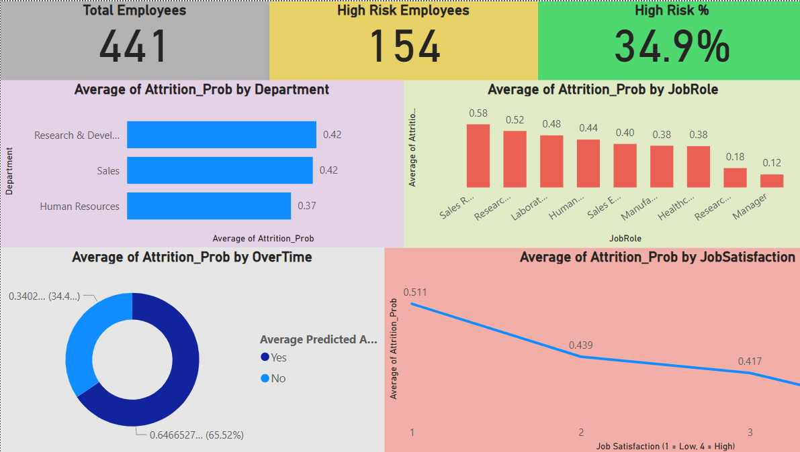

# 💼 HR Analytics Project – Predicting Employee Attrition

📊 **Goal:** Analyze HR data to discover what drives employee attrition and predict which employees are at risk of leaving.  
🧠 **Tools:** Python (pandas, statsmodels, scikit-learn) + Power BI

---

### 🔍 Key Findings
- 🕒 Employees working overtime are **~4x more likely to leave**.
- 🙂 Higher job satisfaction reduces attrition risk by **~27%**.
- 💰 Salary hikes alone are **not significant** for retention.

---

### 🧰 Methods & Models
- Logistic Regression with **Statsmodels** → interpretability  
- Logistic Regression with **Scikit-Learn** → predictive modeling  
- Balanced class weights & threshold tuning  
- **Accuracy:** 0.85 | **ROC-AUC:** 0.77 | **Recall (leavers):** ↑ from 0.14 → 0.75  

---

### 📈 Power BI Dashboard
Visual insights highlighting attrition trends by department, salary level, and satisfaction.

---

### 📂 Files in this repository
- `HR - Analytics.pdf` → full Python analysis  
- Dashboard screenshots → Power BI visualizations  
- `README.md` → project summary  

---

